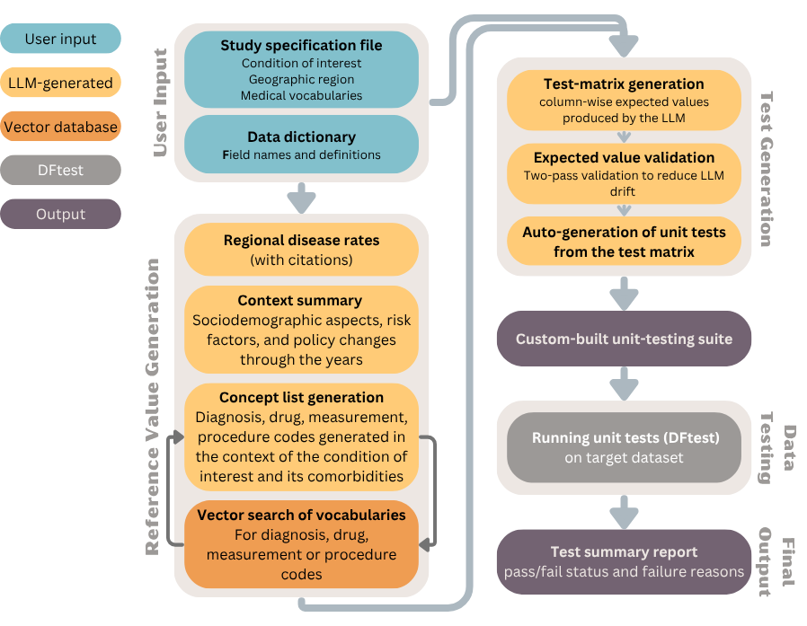

# MDPT: Medical Data Pecking Tool
>A context-aware framework for automated quality assessment of structured medical data, introduced in our paper: [Medical Data Pecking: A Context-Aware Approach for Automated Quality Evaluation of Structured Medical Data](https://arxiv.org/abs/2507.02628)




## Background

Electronic Health Records (EHRs) are widely used for epidemiological studies and AI model development. However, the secondary use of EHR data is hindered by systemic quality issues (such as bias, incompleteness, and inconsistent coding) that limit reproducibility and trustworthiness in research.

MDPT provides a scalable, modular solution for EHR data quality evaluation by:
Generating unit tests based on epidemiological knowledge and study context.
Leveraging LLMs and vector search to automate test construction.
Validating data distributions, completeness, and subgroup characteristics against external references.


## Motivation
EHRs are widely used in medical research and AI applications, yet their secondary use is often compromised by data quality issues. These datasets are typically collected for administrative or clinical operations (not research) and frequently suffer from missing values, misclassification, inconsistent coding, and systematic biases across populations or regions.

Current quality assessment tools focus on surface-level completeness or technical validation but rarely ask: Is this dataset fit for the specific research question at hand?

To address this gap, MDPT introduces a context-aware framework for automated data quality testing. Inspired by unit testing in software engineering, MDPT generates tailored, reference-grounded tests using large language models and applies them systematically across the dataset. This ensures that data used in research and AI workflows is not just complete—but clinically and contextually valid.

## Key Features

- LLM-driven test generation based on condition, geography, vocabularies, and data schema.
- External knowledge grounding using vector search and reference validation (Bing + medical concept vocabularies).
- Muli-level coverage support.


## Instructions
**Prerequisites**
- DFtest 0.5.4 should be pre-installed **where the evaluated dataset is stored**.
- The following system variables should be defined:
  - AZURE_API_KEY_4o - AzureOpenAI API key
  - AZURE_ENDPOINT_4o - AzureOpenAI API endpoint
  - AGENT_CONNECTION_STRING - Azure OpenAI agent connction string
  - BING_API_KEY - Bing API key
  - BING_ENDPOINT - Bing API endpoint

**Generating unit tests**
- Add a definition file and a data dictionary file to 'definitions_and_dictionaries' folder. The data dictionary should contain filed names, descriptions and expected values in the demographic data fields.
- Modify the definition file path in evaluate_data.py.
- Run evaluate_data.py
- The resulting testing suite will be saved in the 'Output' folder under the evaluated condition folder as 'pecking_order_{diagnosis}_{region}.py'
- 'data_eval_{diagnosis}_{region}.py' accessory file is created to assist in running data evaluation.


**Running the generated tests on your data**
- The testing suite and the accessory file can now be moved where the dataset is stored.
- To run the evaluation, import data_eval from the accessory function. Call the function as follows:

```
data_eval(data_df, measurement_df, drug_df)

#data_df - contains the demography, observations and diagnoses
#measurement_df - contains the lab tests and measurements
#drug_df - contains drugs
```

- After running the tests, three output files are created:
  - test_results_diagnoses_demography_Type_2_diabetes_US.json - diagnoses and demography results
  - test_results_measurements_Type_2_diabetes_US.json - measurement results
  - test_results_drugs_Type_2_diabetes_US.json - drug results
- To turn the output files into a final report, please run 'create_latex_report.py'. The path to the definition file and to the required report location should be changed:
  - definition_path
  - data_reports_path
