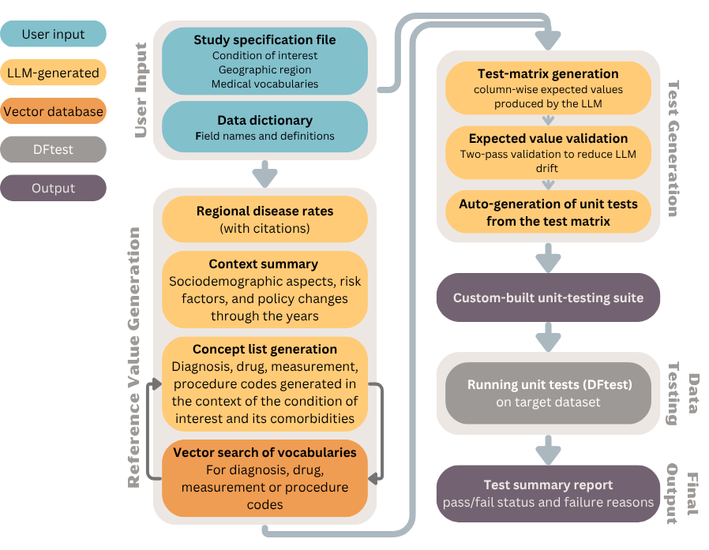

# MDPT: Medical Data Pecking Tool

This repository contains the implementation of the **Medical Data Pecking (MDP)** framework — a generative approach for semantic auditing of Electronic Health Records. The framework adapts software engineering unit testing principles to systematically identify discrepancies between observed medical data and epidemiological evidence, going beyond syntactic validation to detect *Semantic Gaps*.

The method is detailed in our paper: [A Generative Approach for Semantic Auditing of Electronic Health Records](https://arxiv.org/abs/2507.02628)




## Background

Electronic Health Records (EHRs) are increasingly used for clinical AI, epidemiological research, and population health studies. However, EHR data quality remains a persistent concern: 92% of AI practitioners report experiencing data quality issues with negative downstream effects. Existing quality assessment tools focus primarily on syntactic completeness — verifying that fields are non-null and correctly formatted — but fail to capture *semantic plausibility*, i.e., whether the data are clinically consistent with the population it represents.

MDPT introduces **Semantic Data Coverage**: a hierarchical taxonomy that extends validation beyond syntax to distributional and contextual (subpopulation) semantic layers.

### Taxonomy of Semantic Unit Tests

MDPT organises tests into three levels:

| Level | Type | What it checks |
|---|---|---|
| 1 | **Syntactic (Metadata)** | Field presence, data type correctness, non-missing values |
| 2 | **Distributional Semantic** | Population metrics vs. literature baselines (e.g., lab value ranges, disease prevalence) |
| 3 | **Contextual Semantic (Subpopulation)** | Intra-group patterns such as comorbidity rates or drug prevalence within demographic cohorts |

A **Semantic Gap** is declared when data maintains Syntactic Integrity (passes format checks) but fails Semantic Plausibility (diverges from epidemiological ground truth).


## Motivation

Clinical AI and research depend on data that is not just structurally valid, but *semantically plausible* relative to the target population. Current automated tools provide extensive libraries of universal syntactic rules, but cannot capture context-sensitive clinical expectations — such as the expected prevalence of a specific comorbidity in a distinct demographic cohort.

MDPT addresses this gap by using **Large Language Models (LLMs)** and a **Retrieval-Augmented Generation (RAG)** architecture to automatically synthesise executable semantic unit tests from medical literature and standardised clinical vocabularies. Analogously to the selective pecking behaviour in birds, MDPT scans structured health records to identify relevant data fields, flag inconsistencies, and exclude extraneous content.

To prevent hallucinations and ensure tests are anchored in verifiable evidence, a secondary **Auditor Agent** independently verifies each proposed expected value before it is included in the final test suite.


## Key Features

- **Generative semantic test synthesis** using LLMs and a RAG architecture (Bing Search / Tavily + OHDSI vocabulary vector database).
- **Three-level semantic taxonomy**: metadata, distributional, and contextual (subpopulation) validation.
- **Auditor Agent (double-pass verification)**: an independent agent verifies and corrects each proposed reference value before generating unit tests, mitigating hallucinations.
- **Decoupled architecture**: the Generation Module operates only on the study specification and data dictionary — no raw patient data is ever transmitted to external models.
- **Statistical validation** using three criteria: Welch's t-test for distributions, Standardised Mean Difference (SMD ≥ 0.2) for clinical relevance, and proportional tolerance (ratio 0.85–1.15) for categorical prevalence.
- **Tri-state reporting**: each test is classified as *Passed*, *Failed (Semantic Gap)*, or *Inconclusive (No Reference)*.
- **Coverage reporting**: untested fields are explicitly reported to quantify the completeness of the audit.


## Instructions

### Prerequisites

- **DFtest** should be pre-installed **where the evaluated dataset is stored** (the test execution environment).
- Install Python dependencies:
  ```bash
  pip install -r requirements.txt
  ```
- The following environment variables must be set:
  | Variable | Description |
  |---|---|
  | `AZURE_API_KEY_4o` | Azure OpenAI API key |
  | `AZURE_ENDPOINT_4o` | Azure OpenAI API endpoint |
  | `AZURE_ENDPOINT_EMBEDDING` | Azure OpenAI embedding model endpoint |
  | `AGENT_CONNECTION_STRING` | Azure OpenAI agent connection string |
  | `BING_API_KEY` | Bing Search API key (optional, legacy) |
  | `BING_ENDPOINT` | Bing Search API endpoint (optional, legacy) |
  | `TAVILY_API_KEY` | Tavily Search API key |

---

### Step 0 — Build the OHDSI Concept Vector Database

The pipeline uses a [Chroma](https://www.trychroma.com/) vector database pre-loaded with OHDSI clinical concepts to map free-text terms to standardised vocabularies. You only need to do this **once** before running the pipeline for the first time.

**1. Download OHDSI concept data**

Download the `CONCEPT.csv` file from [Athena (OHDSI)](https://athena.ohdsi.org/vocabulary/list). Select the vocabularies relevant to your study (e.g. SNOMED, RxNorm, LOINC, ICD-9) and export.

**2. Convert to JSON**

Place `CONCEPT.csv` in `vector_db_creation/` and run:

```bash
cd vector_db_creation
python csv_to_json.py
```

This produces `concepts.json` in the same folder. Move it to the expected data path:

```bash
mkdir -p data/micro-concepts
mv concepts.json data/micro-concepts/
```

**3. Embed and index**

Run the parallel embedding script to create the Chroma database:

```bash
python vector_db_creation/embed_concepts_parallel.py
```

The index is saved to `data/micro-concepts/embeddings/`. This step calls the Azure OpenAI embedding model (`text-embedding-3-small`) and requires `AZURE_API_KEY_4o` and `AZURE_ENDPOINT_EMBEDDING` to be set.

> **Note:** Embedding all OHDSI concepts can take a while depending on the vocabulary size. The script parallelises calls with up to 40 threads to speed things up.

---

### Step 1 — Define Your Study

Add two files to the `definitions_and_dictionaries/` folder:

1. **Disease definition file** (JSON): specifies the condition of interest, geographic region, and the medical ontologies used (OMOP, ICD-9, SNOMED, etc.).
2. **Data dictionary** (CSV): describes the available database fields — their names, descriptions, and expected values — especially for demographic fields.

Four example definition files are included:

| File | Condition | Dataset | Coding |
|---|---|---|---|
| `disease_definition_path_mimic.json` *(default)* | Congestive Heart Failure | MIMIC-III | ICD-9 |
| `disease_definition_path_t2d.json` | Type 2 Diabetes | All of Us | OMOP |
| `disease_definition_path_ckd.json` | Chronic Kidney Disease | All of Us | OMOP |
| `disease_definition_path_synthea_hypertension.json` | Hypertension | SyntheticMass | SNOMED |

---

### Step 2 — Generate the Semantic Test Suite

Run the main pipeline, passing your definition file and data dictionary:

```bash
# Use the built-in default (Congestive Heart Failure / MIMIC-III)
python evaluate_data.py

# Use a bundled example
python evaluate_data.py --definition disease_definition_path_t2d.json

# Use your own files
python evaluate_data.py \
  --definition path/to/my_definition.json \
  --data-dict  path/to/my_data_dictionary.csv \
  --results    my_results
```

**CLI options:**

| Flag | Short | Default | Description |
|---|---|---|---|
| `--definition` | `-d` | MIMIC-III example | Path to the disease definition JSON file |
| `--data-dict` | `--dd` | path in definition file | Path to the data dictionary CSV (overrides definition file field) |
| `--results` | `-r` | `results` | Name of the top-level output folder |

The pipeline will:
1. Retrieve regional epidemiological statistics via Bing Search / Tavily.
2. Map clinical concepts to standardised vocabularies via a Chroma vector database.
3. Construct a structured test matrix (expected values for diagnoses, drugs, lab tests, procedures, and demographics).
4. Run the **Auditor Agent** to verify and correct expected values (double-pass verification).
5. Generate executable Python unit tests.

Outputs are saved under `<result_folder>/<Diagnosis>_<Region>/`:
- `output/` — logs and reference statistics
- `statistics/` — extracted reference CSVs
- `test_csvs/` — proposed test matrices
- `validated/test_csvs/` — auditor-verified test matrices
- `output/pecking_order_<diagnosis>_<region>.py` — the final test suite
- `data_eval_<diagnosis>_<region>.py` — accessory script for running tests on data

---

### Step 3 — Run the Tests on Your Data

Move the generated test suite and the accessory file to the environment where your dataset is stored. Import and call `data_eval` as follows:

```python
from data_eval_<diagnosis>_<region> import data_eval

data_eval(data_df, measurement_df, drug_df)

# data_df        — demographics, observations, and diagnoses
# measurement_df — lab tests and measurements
# drug_df        — drug prescriptions
```

Three JSON result files are created (example for Type 2 Diabetes, US):
- `test_results_diagnoses_demography_Type_2_diabetes_US.json`
- `test_results_measurements_Type_2_diabetes_US.json`
- `test_results_drugs_Type_2_diabetes_US.json`

---

### Step 4 — Generate a Report

Run `create_latex_report.py` to compile results into a LaTeX report. Update the paths:

```python
definition_path   = "path/to/disease_definition.json"
data_reports_path = "path/to/json/results/folder"
```

Each test in the report is colour-coded as **Passed** (green), **Failed / Semantic Gap** (red), or **No Reference** (orange).

---

## Example Results

Example test suites and result files for four cohorts are provided in `example_results/`:
- `Type 2 diabetes_US` (All of Us)
- `Chronic Kidney Disease_US` (All of Us)
- `Hypertension_Massachusetts` (SyntheticMass)
- `Congestive Heart Failure_Massachusetts` (MIMIC-III)

---

## Datasets

| Dataset | Access | Coding |
|---|---|---|
| [All of Us v7](https://www.researchallofus.org/) | Controlled access (researcher workbench) | OMOP |
| [MIMIC-III v1.4](https://mimic.mit.edu/) | Credentialed access via PhysioNet | ICD-9 |
| [SyntheticMass](https://syntheticmass.mitre.org/download.html) | Publicly available | SNOMED-CT |

---

## License

This project is licensed under the MIT License.